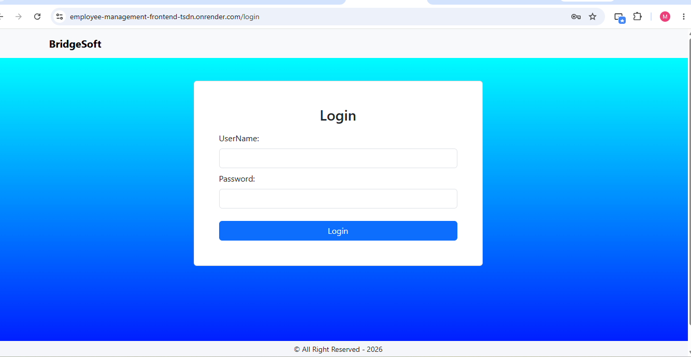
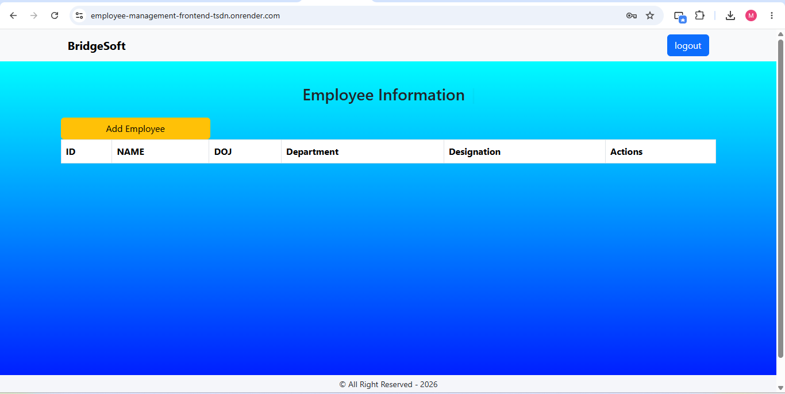
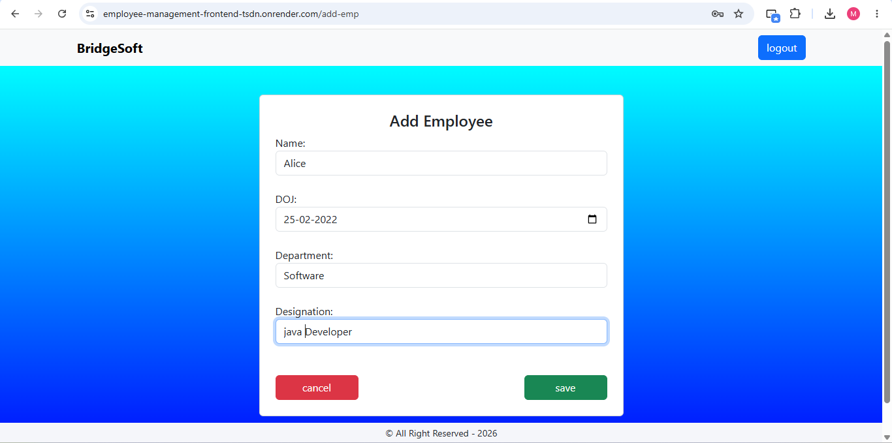
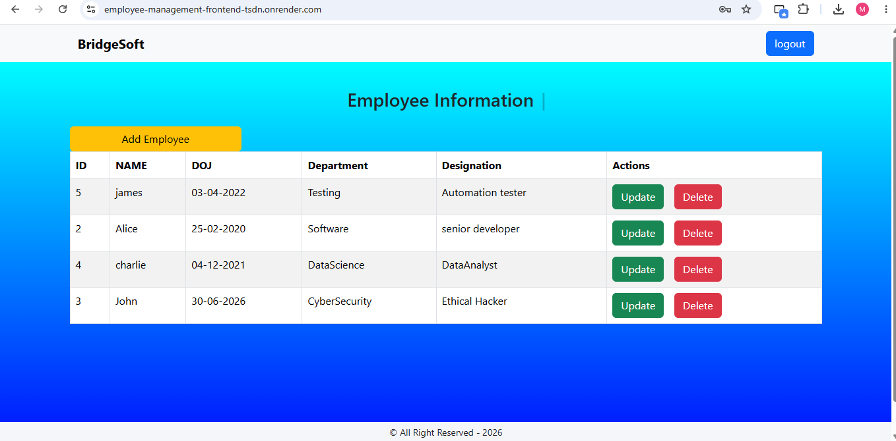

# Employee Management System


A full-stack Employee Management System built using Spring Boot and React that enables users to create, view, update, and delete employee records through a responsive web interface.

---

## 🌍 Live Application

| | |
|---|---|
| **Frontend**    | https://employee-management-frontend-tsdn.onrender.com |
| **Backend API** | https://employee-management-system-0kmx.onrender.com   |

---

## 🚀 Tech Stack

**Backend**
- Java 17+ (Tested on Java 25 LTS)
- Spring Boot
- Spring Data JPA
- Maven
- Lombok

**Frontend**
- React
- Vite
- JavaScript (ES6+)
- Axios (API calls)
- CSS

---

## 🗄️ Database

### Development
- MySQL

### Production
- PostgreSQL (Neon)

---

## ✨ Features

- Add new employees
- View all employees
- Update employee details
- Delete employee records
- RESTful API architecture connecting frontend and backend
- Clean separation of concerns (Controller → Service → Repository → Model)

---

## 🧠 Skills Demonstrated

- Java
- Spring Boot
- REST API Development
- React
- CRUD Operations
- JPA / Hibernate
- MySQL / PostgreSQL
- Maven
- Git & GitHub
- Full Stack Development

---

## 🏛️ Architecture

```text
React Frontend
       ↓
Spring Boot REST API
       ↓
MySQL / PostgreSQL
```

---

## 📸 Screenshots

# 📷 Project Screenshots

## Login Page



---

## Dashboard



---

## Add Employee



---

## Employee List




---

## 🏗️ Project Structure

```
employee-management-system/
├── backend/          # Spring Boot REST API
│   └── src/main/java/...
├── frontend/         # React + Vite client
│   └── src/...
└── README.md
```

---

## ⚙️ Running Locally

### Prerequisites
- Java 17+ (Tested on Java 25 LTS)
- Node.js 18+
- MySQL

### Backend

```bash
cd backend
mvn clean package
mvn spring-boot:run
```

> If Maven is not configured in your system PATH, run the backend directly using STS/Eclipse:
>
> Right Click Project → Run As → Spring Boot App.

Backend runs on `http://localhost:9191`

### Frontend

```bash
cd frontend
npm install
npm run dev
```

Frontend runs on `http://localhost:5173`

---

## 🌐 API Endpoints

| Method | Endpoint | Description |
|--------|----------|-------------|
| GET | `/api/employees` | Get all employees |
| GET | `/api/employees/{id}` | Get employee by ID |
| POST | `/api/employees` | Add new employee |
| PUT | `/api/employees/{id}` | Update employee |
| DELETE | `/api/employees/{id}` | Delete employee |

---

## 🚀 Deployment

| | |
|---|---|
| **Frontend** | Coming Soon |
| **Backend API** | Coming Soon |

---

## 🔮 Future Enhancements

- Search and filter employees
- Form validation
- Department management
- Authentication and Authorization
- Docker deployment
- CI/CD pipeline

---

## 👤 Author

**MD Adnan**  
Java Full Stack Developer  
🔗 LinkedIn: https://linkedin.com/in/md-adnan-tech  
🔗 GitHub: https://github.com/mdadnan-tech  
📷 Gmail:md.adnan.prof@gmail.com

---

## 📄 License

This project is open source and available under the [MIT License](LICENSE).
